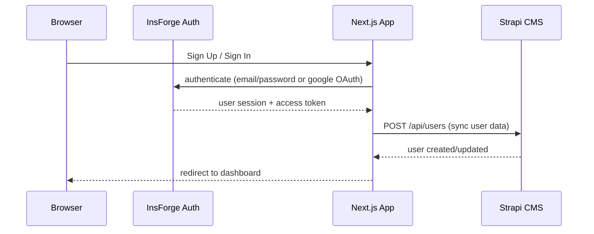

# Strapi CMS Collections

## Collection: User

This collection stores application user data synced from InsForge Authentication.

### Collection Details

| Field          | Type      | Required | Default | Description                          |
|----------------|-----------|----------|---------|--------------------------------------|
| `email`        | string    | Yes      | -       | User email address                   |
| `name`         | string    | Yes      | -       | User display name                    |
| `insforgeId`   | string    | Yes      | -       | User ID from InsForge Auth           |
| `authProvider` | string    | Yes      | local   | Auth method: `local` or `google`     |
| `avatarUrl`    | text      | No       | null    | Profile picture URL                  |

### Strapi Content Type Configuration

To create this collection in the Strapi Admin Panel:

1. Go to **Content-Type Builder** → **Create new collection type** → Name: `User`
2. Add the following fields:
   - `email` → **Text** (Short text, required, unique)
   - `name` → **Text** (Short text, required)
   - `insforgeId` → **Text** (Short text, required)
   - `authProvider` → **Enumeration** with values: `local`, `google` (required, default: `local`)
   - `avatarUrl` → **Text** (Long text, optional)

3. Enable **Draft & Publish**: No (users are always published)
4. Configure API permissions under **Settings → Users & Permissions → Roles → Public/Authenticated**:
   - `User`: `create`, `update`, `find`, `findOne`

### API Endpoints

| Method | Endpoint                          | Description                    |
|--------|-----------------------------------|--------------------------------|
| POST   | `/api/users`                      | Create a new user              |
| GET    | `/api/users`                      | List all users                 |
| GET    | `/api/users/:id`                  | Get a single user              |
| PUT    | `/api/users/:id`                  | Update a user                  |
| DELETE | `/api/users/:id`                  | Delete a user                  |
| GET    | `/api/users?filters[email][$eq]=` | Find user by email (used by app) |

### Data Flow



### Environment Variables

```
NEXT_PUBLIC_STRAPI_URL=http://localhost:1337
STRAPI_API_TOKEN=your-strapi-api-token
```

The `STRAPI_API_TOKEN` should be an API Token created in **Settings → API Tokens** with at least `create` and `update` permissions on the `User` collection.
